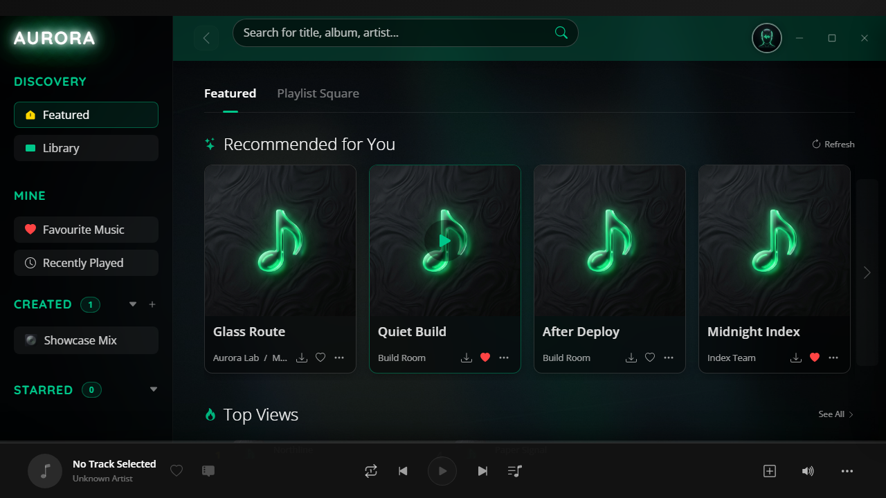
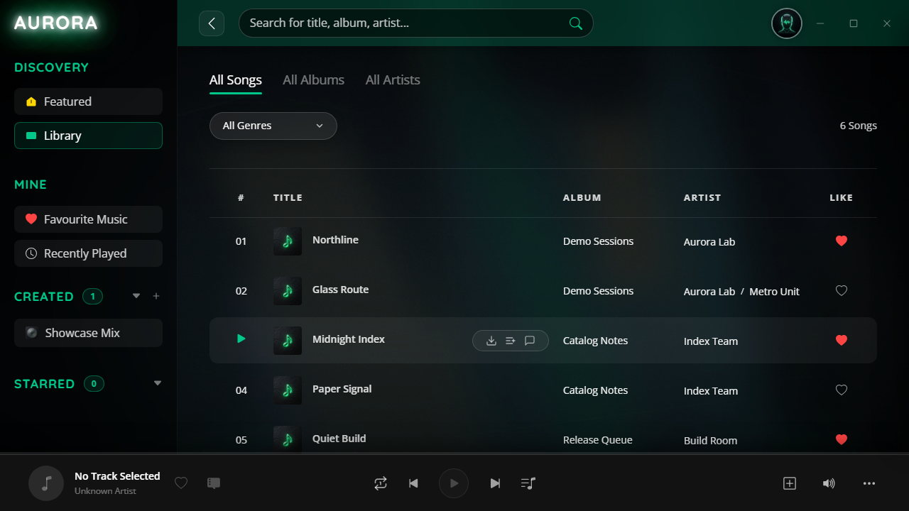
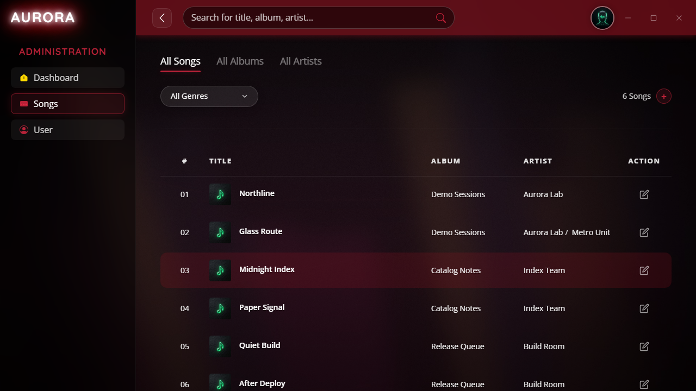
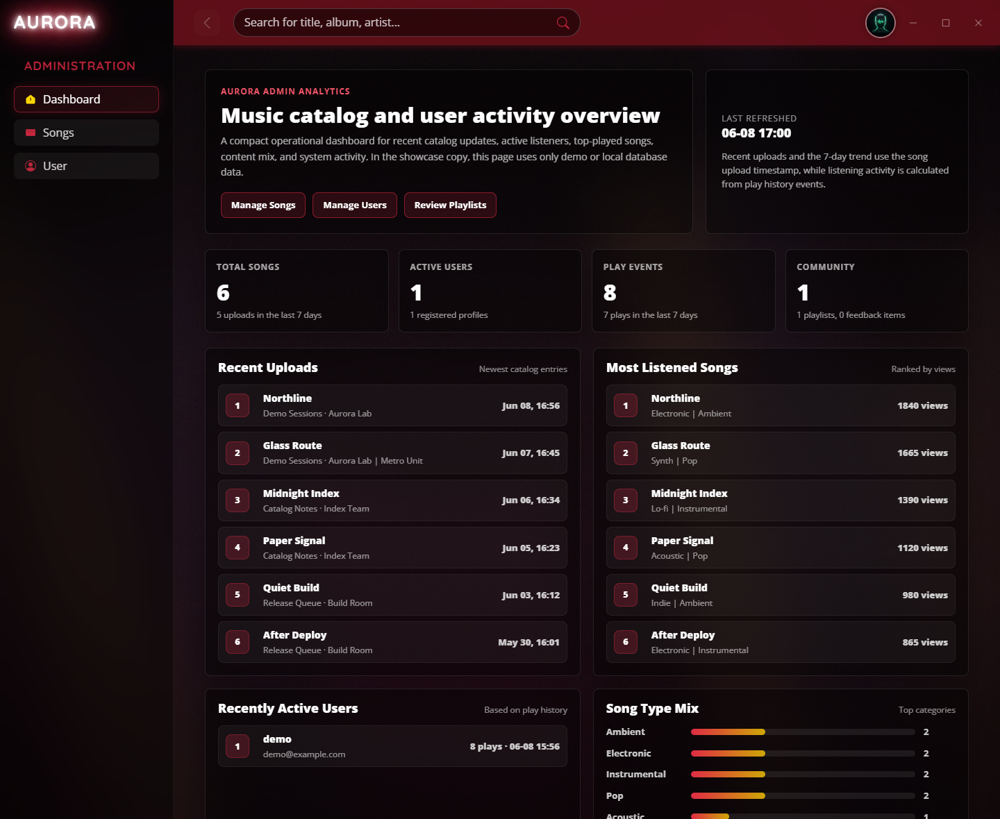

# Aurora Showcase

## 中文

Aurora 是一个基于 Django 的音乐库管理与播放 Web 应用，并提供可选的 Electron 桌面端封装。

这是一个经过清理的展示版本。仓库保留应用代码、模板、静态资源、数据库结构和占位媒体，但移除了原始音乐数据库、上传歌曲、上传歌词、歌单封面、日志、备份文件和私有运行数据。

### 项目背景

原始 MusicHub 项目起点是课程团队项目。我早期主要参与数据库设计和音乐库模块。课程交付后，我继续维护并扩展项目，包括 Electron 桌面封装、管理员侧功能优化、播放体验调整、展示版脱敏与清理。

这个版本的定位是“可公开展示的代码副本”，不是生产环境版本。

### 主要功能

- 用户注册、登录、个人资料设置和头像上传。
- 音乐库浏览、搜索、专辑页和艺术家页。
- 歌单创建、编辑、收藏和歌单排序。
- 基于 HTML5 Audio 的全局播放器与播放队列。
- `.lrc` 歌词显示。
- 评论和回复交互。
- 自定义 Django Admin 页面，用于管理歌曲、用户、歌单和元数据。
- 管理员数据看板，用于查看最近加入的歌曲、活跃用户、热门歌曲、类型分布和近期活动。
- 可选 Electron 桌面入口，用于本地桌面演示。

### 截图

`assets/screenshots` 中的截图只使用虚构展示数据。仓库不应包含原始数据库、上传歌曲、真实用户数据或生成的占位音频。









本地重新生成截图数据：

```text
python manage.py seed_showcase --with-sample-content --with-admin
python manage.py runserver 127.0.0.1:8000
```

该命令只生成本地截图数据；临时后台账号为 `admin / admin123456`，数据库已被 Git 忽略。

截图完成后，重置本地数据库：

```text
python manage.py reset_showcase --noinput
```

### 展示版清理范围

这个副本刻意不包含：

- 原始 `db.sqlite3` 内容。
- 上传的歌曲文件。
- 上传的歌词文件。
- 上传的歌曲封面和歌单封面。
- 服务日志、数据库备份和本地缓存目录。
- 之前的私有内容开关和过滤机制。

本地工作目录可以临时生成 SQLite 数据库用于测试，但数据库已被 Git 忽略，不应提交。

### 技术栈

- Python 3.14
- Django 6
- SQLite，本地开发使用
- Django Templates
- JavaScript and HTML5 Audio
- Electron，用于桌面封装

### 本地启动

创建虚拟环境并安装依赖：

```text
python -m venv .venv
pip install -r requirements.txt
```

创建本地环境变量文件：

```text
copy .env.example .env
```

部署前请在 `.env` 中设置真实的 `DJANGO_SECRET_KEY`。应用也可以直接读取以下环境变量：

- `DJANGO_SECRET_KEY`
- `DJANGO_DEBUG`
- `DJANGO_ALLOWED_HOSTS`

初始化数据库：

```text
python manage.py migrate
```

创建一个无歌曲、无歌单的干净演示用户：

```text
python manage.py reset_showcase --noinput
```

如需为截图临时生成虚构歌曲、活动数据和后台账号：

```text
python manage.py seed_showcase --with-sample-content --with-admin
```

启动 Web 应用：

```text
python manage.py runserver 127.0.0.1:8000
```

打开：

```text
http://127.0.0.1:8000/
```

### Electron 模式

安装 Node 依赖：

```text
npm install
```

启动桌面端封装：

```text
npm start
```

Electron 入口会启动 Django 开发服务，并打开本地应用窗口。

### 下载版 / Release 构建

GitHub Release 推荐上传两个 Windows x64 产物：

- `Aurora-Showcase-1.0.0-Windows-Portable.exe`：免安装版，下载后可直接运行。
- `Aurora-Showcase-1.0.0-Windows-Setup.exe`：安装包版本。

首次启动时，桌面端会在当前 Windows 用户数据目录中创建本地 SQLite 数据库和媒体目录，执行数据库迁移，并初始化一个无歌曲、无歌单的展示用户。应用包内不包含原始数据库、上传歌曲或私有运行数据。

默认账号：

- 应用演示用户：`demo / demo123456`
- Django Admin 临时账号：`admin / admin123456`

构建 release：

```text
npm install
npm run dist
```

`npm run dist` 会先执行 `scripts/prepare_python_runtime.py`，下载 Windows embeddable Python 到 `.release/python`，并安装 `requirements.txt` 中的 Django 依赖。最终产物输出到 `dist/`，该目录已被 Git 忽略。

### 验证

基础项目检查：

```text
python manage.py check
```

可选测试：

```text
python manage.py test music
```

当前展示版验证目标：

- `python manage.py check`
- `python manage.py test music`
- 使用 `demo / demo123456` 做登录冒烟测试
- 如生成截图数据，使用 `admin / admin123456` 查看管理员数据看板
- 最终重置为一个演示用户，且歌曲、歌单、评论均为零

### 部署注意

部署前：

- 设置 `DJANGO_DEBUG=False`。
- 设置强随机 `DJANGO_SECRET_KEY`。
- 将 `DJANGO_ALLOWED_HOSTS` 设置为生产域名或主机名。
- 使用生产级 Web Server 和静态/媒体文件服务方案。
- 不要提交 SQLite 数据库、上传媒体、日志或 `.env`。
- 如果项目继续产品化，应重新审视当前自定义用户资料模型。

## English

Aurora is a Django-based music library and playback web application, with an optional Electron desktop wrapper.

This repository is a sanitized showcase version. It keeps the application code, templates, static assets, database schema, and placeholder media, but removes the original music database, uploaded songs, uploaded lyrics, playlist covers, logs, backups, and private runtime data.

### Project Background

The original MusicHub project began as a course team project. My early contribution focused on database design and the music library module. After the course delivery, I continued maintaining and extending the project, including desktop packaging with Electron, admin-side improvements, playback experience refinements, and showcase cleanup.

This copy is intended as a public portfolio version, not as a production deployment.

### Main Features

- User registration, login, profile settings, and avatar upload.
- Music library browsing, search, album pages, and artist pages.
- Playlist creation, playlist editing, favorites, and playlist ordering.
- Persistent global HTML5 audio player with queue management.
- Lyrics display from `.lrc` files.
- Comment and reply interactions.
- Custom Django Admin pages for managing songs, users, playlists, and metadata.
- Admin analytics dashboard for recent catalog entries, active users, top songs, type distribution, and recent activity.
- Optional Electron shell for local desktop demos.

### Screenshots

Screenshots in `assets/screenshots` are captured with fake showcase data only. The repository should not include the original database, uploaded songs, private user data, or generated placeholder audio.


To regenerate screenshot data locally:

```text
python manage.py seed_showcase --with-sample-content --with-admin
python manage.py runserver 127.0.0.1:8000
```

This command creates local screenshot data only; the temporary admin login is `admin / admin123456`, and the database is ignored by Git.

After screenshots are captured, reset the local database:

```text
python manage.py reset_showcase --noinput
```

### Showcase Sanitization

This copy intentionally does not include:

- The original `db.sqlite3` content.
- Uploaded song files.
- Uploaded lyric files.
- Uploaded song covers and playlist covers.
- Server logs, backup databases, and local cache folders.
- The previous private-content toggle and filtering mechanism.

The local working copy may temporarily create a small SQLite database for testing. The database is ignored by Git and should not be committed.

### Tech Stack

- Python 3.14
- Django 6
- SQLite for local development
- Django Templates
- JavaScript and HTML5 Audio
- Electron for desktop packaging

### Local Setup

Create a virtual environment and install dependencies:

```text
python -m venv .venv
pip install -r requirements.txt
```

Create a local environment file:

```text
copy .env.example .env
```

Set a real `DJANGO_SECRET_KEY` in `.env` before deployment. The application can also read these environment variables directly:

- `DJANGO_SECRET_KEY`
- `DJANGO_DEBUG`
- `DJANGO_ALLOWED_HOSTS`

Initialize the database:

```text
python manage.py migrate
```

Create a clean demo user with no songs or playlists:

```text
python manage.py reset_showcase --noinput
```

To temporarily generate fake songs, activity data, and an admin account for screenshots:

```text
python manage.py seed_showcase --with-sample-content --with-admin
```

Run the web application:

```text
python manage.py runserver 127.0.0.1:8000
```

Open:

```text
http://127.0.0.1:8000/
```

### Electron Mode

Install Node dependencies:

```text
npm install
```

Start the desktop wrapper:

```text
npm start
```

The Electron entry point starts the Django development server and opens the local app.

### Downloadable Release

Recommended GitHub Release artifacts for Windows x64:

- `Aurora-Showcase-1.0.0-Windows-Portable.exe`: portable build that can be run directly after download.
- `Aurora-Showcase-1.0.0-Windows-Setup.exe`: installer build.

On first launch, the desktop app creates a local SQLite database and media directory under the current Windows user data directory, runs migrations, and initializes a clean showcase user with no songs or playlists. The packaged app does not include the original database, uploaded songs, or private runtime data.

Default logins:

- App demo user: `demo / demo123456`
- Temporary Django Admin user: `admin / admin123456`

Build the release artifacts:

```text
npm install
npm run dist
```

`npm run dist` first runs `scripts/prepare_python_runtime.py`, which downloads Windows embeddable Python into `.release/python` and installs the Django dependencies from `requirements.txt`. The final artifacts are written to `dist/`, which is ignored by Git.

### Verification

Basic project check:

```text
python manage.py check
```

Optional tests:

```text
python manage.py test music
```

Current showcase verification target:

- `python manage.py check`
- `python manage.py test music`
- Login smoke test with `demo / demo123456`
- If screenshot data is generated, review the admin analytics dashboard with `admin / admin123456`
- Final showcase reset with one demo user and zero songs/playlists/comments

### Deployment Notes

Before deploying:

- Set `DJANGO_DEBUG=False`.
- Set a strong `DJANGO_SECRET_KEY`.
- Set `DJANGO_ALLOWED_HOSTS` to the production host names.
- Use a production web server and static/media serving strategy.
- Do not commit SQLite databases, uploaded media, logs, or `.env`.
- Review the custom user profile model if this project is evolved beyond a showcase.
